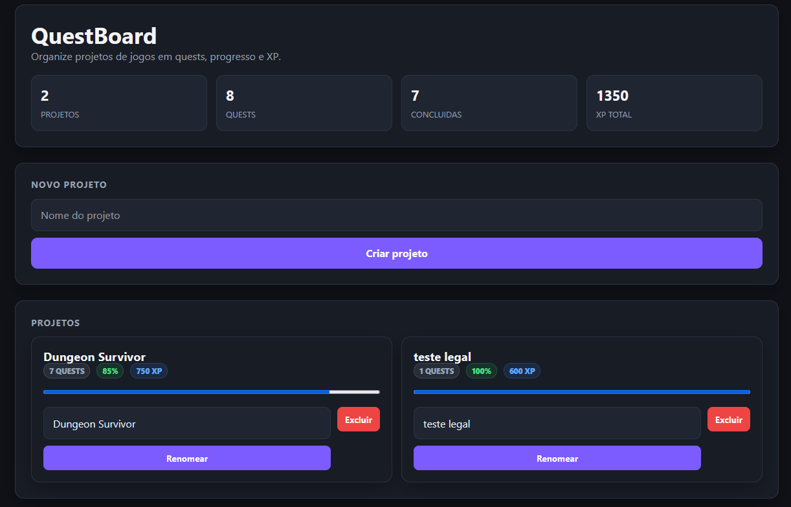
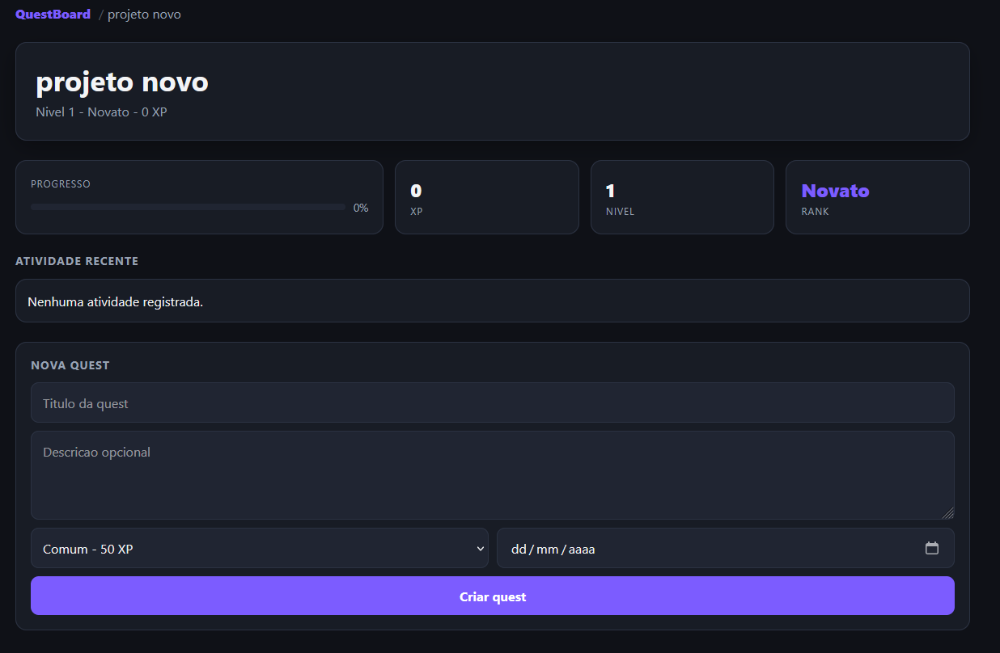

# QuestBoard

> Kanban gamificado para acompanhar o desenvolvimento de jogos — construído do zero com Go.

QuestBoard é um sistema web estilo Kanban onde cada tarefa é uma **Quest**, o progresso vira **XP** e projetos ganham **Level** e **Rank** conforme as tarefas são concluídas.

O projeto existe principalmente para aprender engenharia de software construindo algo real — sem frameworks, sem ORMs, sem magia.

---

## Screenshots

### Home: Lista de Projetos

<!-- Adicione um print da página inicial aqui -->
<!-- Exemplo:  -->

```


```

---

### Board: Kanban do Projeto

<!-- Adicione um print do board Kanban aqui -->
<!-- Exemplo:  -->

```


```

---

### Card: Detalhes e Edição

<!-- Adicione um print de um card expandido com o form de edição aqui -->
<!-- Exemplo:  -->

```


```

---

## Funcionalidades

### Projetos
- [x] Criar projeto
- [x] Renomear projeto
- [x] Excluir projeto
- [x] Dashboard com métricas globais (projetos, quests, XP total)

### Cards (Quests)
- [x] Criar card com título, descrição, raridade e prazo
- [x] Editar card inline (formulário dentro do próprio card)
- [x] Excluir card
- [x] Mover entre colunas via drag & drop
- [x] Arrastar para reordenar dentro da coluna
- [x] Status e ordem persistidos ao recarregar a página

### Gamificação
- [x] Sistema de XP por raridade de card
- [x] Level calculado a partir do XP acumulado
- [x] Rank baseado no level (Novato → Aventureiro → Herói → Lenda)
- [x] Conquistas desbloqueadas por progressão
- [x] Log de atividades recentes do projeto

### Visual
- [x] Badges de raridade (Comum / Rara / Épica / Lendária)
- [x] Badges de status por cor
- [x] Prazo com indicador de atraso
- [x] Barra de progresso por projeto
- [x] Layout responsivo (desktop, tablet, mobile)

---

## Raridade dos Cards

| Raridade   | XP   | Cor      |
|------------|------|----------|
| Comum      |  50  | Cinza    |
| Rara       | 150  | Azul     |
| Épica      | 300  | Roxo     |
| Lendária   | 600  | Dourado  |

---

## Stack

**Backend**
- Go (sem frameworks)
- `net/http` — servidor HTTP
- `html/template` — renderização server-side

**Frontend**
- HTML semântico
- CSS puro (variáveis, grid, responsivo)
- JavaScript vanilla (drag & drop)

**Persistência**
- JSON em arquivo (`data/projects.json`)

**Ferramentas**
- Git / GitHub
- WSL

---

## Arquitetura

```
HTTP Request
     ↓
  Handler        → lê request, chama service, renderiza template
     ↓
  Service        → regras de negócio, validações, erros sentinela
     ↓
  Storage        → lê e escreve JSON
     ↓
  Model          → structs + métodos de domínio (XP, Level, Rank...)
```

Cada camada tem responsabilidade única. Handlers nunca acessam storage diretamente.

---

## Estrutura de Arquivos

```
questboard/
├── cmd/
│   └── server/
│       └── main.go              ← ponto de entrada, registro de rotas
│
├── internal/
│   ├── handler/
│   │   ├── error_handler.go     ← helper: traduz erros de service em HTTP
│   │   ├── project_handler.go   ← GET / e GET /project
│   │   ├── project_create_handler.go
│   │   ├── project_update_handler.go
│   │   ├── project_delete_hanlder.go
│   │   ├── card_handler.go      ← criar e mover card
│   │   ├── card_update_handler.go
│   │   ├── card_delete_handler.go
│   │   ├── card_status_handler.go
│   │   └── card_reorder_handler.go
│   │
│   ├── model/
│   │   ├── project.go           ← Project + Progress, XP, Level, Rank, Achievements
│   │   ├── card.go              ← Card + XP, IsLate, DeadlineLabel, RarityLabel
│   │   ├── dashboard.go
│   │   ├── achievement.go
│   │   └── activity.go
│   │
│   ├── service/
│   │   ├── validation_service.go  ← erros sentinela + helpers isValidRarity/Status
│   │   ├── project_service.go
│   │   ├── project_update_service.go
│   │   ├── project_delete_service.go
│   │   ├── card_service.go
│   │   ├── card_update_service.go
│   │   ├── card_delete_service.go
│   │   ├── card_status_service.go
│   │   ├── card_reorder_service.go
│   │   └── activity_service.go
│   │
│   └── storage/
│       └── json_store.go        ← LoadProjects / SaveProjects
│
├── web/
│   ├── templates/
│   │   ├── home.html            ← lista de projetos + dashboard
│   │   └── project.html         ← board kanban + criação/edição de cards
│   │
│   └── static/
│       ├── css/
│       │   └── style.css
│       └── js/
│           └── kanban.js        ← drag & drop com persistência de status e ordem
│
├── data/
│   └── projects.json            ← persistência local
│
├── go.mod
└── README.md
```

---

## Rotas

| Método | Rota              | Descrição                        |
|--------|-------------------|----------------------------------|
| GET    | `/`               | Home — lista de projetos         |
| GET    | `/project?id=`    | Board Kanban do projeto          |
| POST   | `/projects`       | Criar projeto                    |
| POST   | `/projects/rename`| Renomear projeto                 |
| POST   | `/projects/delete`| Excluir projeto                  |
| POST   | `/cards`          | Criar card                       |
| POST   | `/cards/update`   | Editar card                      |
| POST   | `/cards/delete`   | Excluir card                     |
| POST   | `/cards/move`     | Avançar status do card           |
| POST   | `/cards/status`   | Atualizar status diretamente     |
| POST   | `/cards/reorder`  | Salvar ordem e status (JSON)     |

---

## Modelo de Dados

```go
type Project struct {
    ID         string
    Name       string
    Cards      []Card
    Activities []Activity
}

type Card struct {
    ID          string
    Title       string
    Description string
    Status      string    // backlog | doing | done
    Rarity      string    // common | rare | epic | legendary
    Deadline    string    // YYYY-MM-DD
    Order       int
}
```

### Exemplo — `data/projects.json`

```json
[
  {
    "ID": "1750000000000000000",
    "Name": "Dungeon Survivor",
    "Cards": [
      {
        "ID": "1750000000000000001",
        "Title": "Sistema de XP",
        "Description": "Ganhar XP ao derrotar inimigos",
        "Status": "doing",
        "Rarity": "epic",
        "Deadline": "2025-07-01",
        "Order": 0
      }
    ],
    "Activities": [
      {
        "Message": "🚀 Quest iniciada: Sistema de XP",
        "Time": "15/06 14:32"
      }
    ]
  }
]
```

---

## Como executar

**Requisitos:** Go 1.21+

```bash
# Clonar
git clone https://github.com/Hayversong/questboard.git
cd questboard

# Executar
go run ./cmd/server
```

Abrir no navegador:

```
http://localhost:8080
```

Os dados são salvos automaticamente em `data/projects.json`. O arquivo é criado na primeira execução.

---

## Aprendizados

Conceitos praticados durante o desenvolvimento:

- Servidor HTTP sem framework com `net/http`
- Renderização server-side com `html/template`
- Separação de responsabilidades em camadas (Handler → Service → Storage)
- Erros sentinela com `errors.New` e `errors.Is`
- Persistência com `encoding/json`
- Métodos em structs Go (domínio rico no model)
- Drag & drop com a API nativa do navegador
- CSS Grid e responsividade sem framework

---

## Roadmap

- [ ] Migrar persistência para SQLite
- [ ] Filtro e busca de cards
- [ ] Tags nos cards
- [ ] Responsáveis por card
- [ ] API REST (JSON responses)
- [ ] Docker
- [ ] Deploy

---

Feito por [Hayverson](https://github.com/Hayversong) — projeto de aprendizado em Go.
